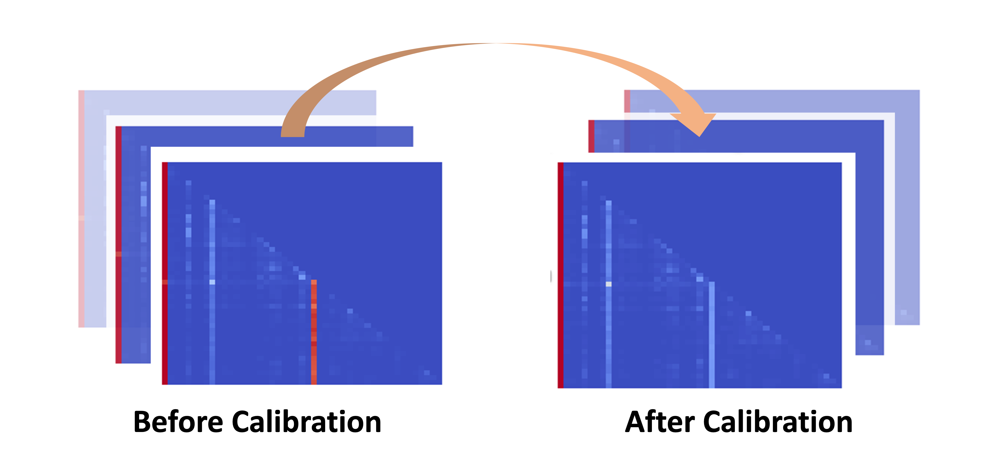

I am the second year graduate student from [CSE-CoC](https://cse.gatech.edu/), [Georgia Institute of Technology](https://www.gatech.edu/). 
I am planning to apply for the PhD program starting in Fall 2025. My current research interests focus on developing efficient Large Language Models (LLMs) algorithms and machine learning systems. 

I am very fortunate to be advised by [Prof. Yingyan (Celine) Lin](https://eiclab.scs.gatech.edu/pages/team.html) of [EIC](https://eiclab.scs.gatech.edu/) Lab as a research intern from [School of Computer Science](https://scs.gatech.edu/), Georgia Tech. Additionally, I am advised by [Prof. Minjia Zhang](https://minjiazhang.github.io/) as a 2024 summer research intern from [Department of Computer Science](https://cs.illinois.edu/), University of Illinois Urbana-Champaign.

Publications
======

  

    
  

  

    <h3>Unveiling and Harnessing Hidden Attention Sinks: Enhancing Large Language Models without Training through Attention Calibration</h3>
    
Zhongzhi Yu*, <strong>Zheng Wang*</strong>, Yonggan Fu, Huihong Shi, Khalid Shaikh, Yingyan (Celine) Lin

    
<i>2024 International Conference of Machine Learning, ICML 2024</i>

<!--     
 -->
      <a href="https://arxiv.org/abs/2406.15765">PDF</a> |
      <a href="https://github.com/GATECH-EIC/ACT">Code</a> |
<!--     
 -->
<!--     
We propose Control4D, an approach to high-fidelity and spatiotemporal-consistent 4D portrait editing with only text instructions.
 -->
  

