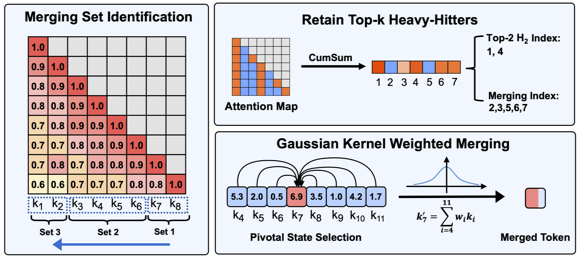
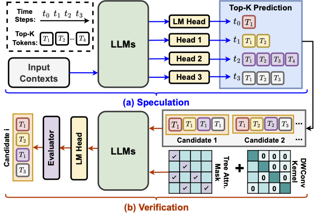
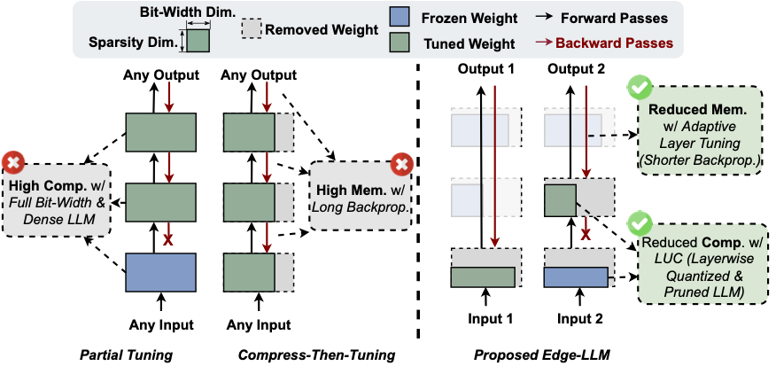
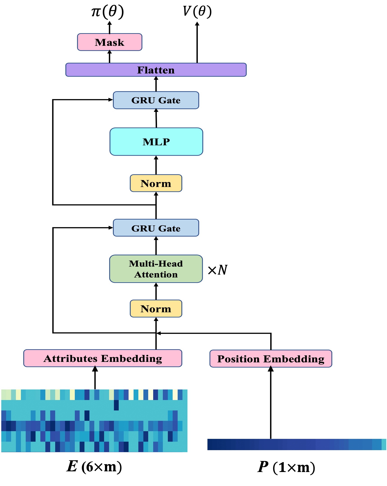

I am the second year graduate student from [CSE-CoC](https://cse.gatech.edu/), [Georgia Institute of Technology](https://www.gatech.edu/). 
I am planning to apply for the PhD program starting in Fall 2025. My current research interests focus on developing efficient Large Language Models (LLMs) algorithms and machine learning systems. 

I am very fortunate to be advised by [Prof. Yingyan (Celine) Lin](https://eiclab.scs.gatech.edu/pages/team.html) of [EIC](https://eiclab.scs.gatech.edu/) Lab as a research intern from [School of Computer Science](https://scs.gatech.edu/), Georgia Tech. Additionally, I am advised by [Prof. Minjia Zhang](https://minjiazhang.github.io/) as a 2024 summer research intern from [Department of Computer Science](https://cs.illinois.edu/), University of Illinois Urbana-Champaign.

Publications
======

  

    
  

  

    <h3 style="margin: 0;">Model Tells You Where to Merge: Adaptive KV Cache Merging for LLMs on Long-Context Tasks</h3>
    
<strong>Zheng Wang</strong>, Boxiao Jin, Zhongzhi Yu, Minjia Zhang

    
<i>preprint</i>

    

      <a href="https://arxiv.org/abs/2407.08454">PDF</a> |
<!--       <a href="https://github.com/GATECH-EIC/ACT">Code</a> | -->
    

<!--     
We propose Control4D, an approach to high-fidelity and spatiotemporal-consistent 4D portrait editing with only text instructions.
 -->
  

  

    
  

  

    <h3 style="margin: 0;">Unveiling and Harnessing Hidden Attention Sinks: Enhancing Large Language Models without Training through Attention Calibration</h3>
    
Zhongzhi Yu*, <strong>Zheng Wang*</strong>, Yonggan Fu, Huihong Shi, Khalid Shaikh, Yingyan (Celine) Lin

    
<i>2024 International Conference of Machine Learning, ICML 2024</i>

    

      <a href="https://arxiv.org/abs/2406.15765">PDF</a> |
      <a href="https://github.com/GATECH-EIC/ACT">Code</a> |
    

<!--     
We propose Control4D, an approach to high-fidelity and spatiotemporal-consistent 4D portrait editing with only text instructions.
 -->
  

  

    
  

  

    <h3 style="margin: 0;">When Linear Attention Meets Autoregressive Decoding: Towards More Effective and Efficient Linearized Large Language Models</h3>
    
Haoran You, Yichao Fu, <strong>Zheng Wang</strong>, Amir Yazdanbakhsh, Yingyan (Celine)Lin

    
<i>2024 International Conference of Machine Learning, ICML 2024</i>

    

      <a href="https://arxiv.org/abs/2406.07368">PDF</a> |
      <a href="https://github.com/GATECH-EIC/Linearized-LLM">Code</a> |
    

<!--     
We propose Control4D, an approach to high-fidelity and spatiotemporal-consistent 4D portrait editing with only text instructions.
 -->
  

  

    
  

  

    <h3 style="margin: 0;">EDGE-LLM: Enabling Efficient Large Language Model Adaptation on Edge Devices via Layerwise Unified Compression and Adaptive Layer Tuning & Voting</h3>
    
Zhongzhi Yu, <strong>Zheng Wang</strong>, Yuhan Li, Haoran You, Ruijie Gao, Xiaoya Zhou, Sreenidhi Reedy Bommu, Yang Katie Zhao, Yingyan Celine Lin

    
<i>61st ACM/IEEE Design Automation Conference, DAC 2024</i>

    

      <a href="https://arxiv.org/abs/2406.15758">PDF</a> |
      <a href="https://github.com/GATECH-EIC/Edge-LLM">Code</a> |
    

<!--     
We propose Control4D, an approach to high-fidelity and spatiotemporal-consistent 4D portrait editing with only text instructions.
 -->
  

  

    
  

  

    <h3 style="margin: 0;">XRouting: Explainable Vehicle Rerouting for Urban Road Congestion Avoidance using Deep Reinforcement Learning</h3>
    
<strong>Zheng Wang</strong>, Shen Wang

    
<i>2022 IEEE Smart City Conference, ISC2 2022</i>

    

      <a href="https://ieeexplore.ieee.org/document/9922404">PDF</a> |
      <a href="https://github.com/ZKBig/XRouting">Code</a> |
    

<!--     
We propose Control4D, an approach to high-fidelity and spatiotemporal-consistent 4D portrait editing with only text instructions.
 -->
  

